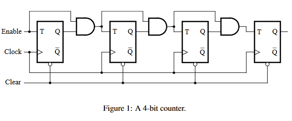
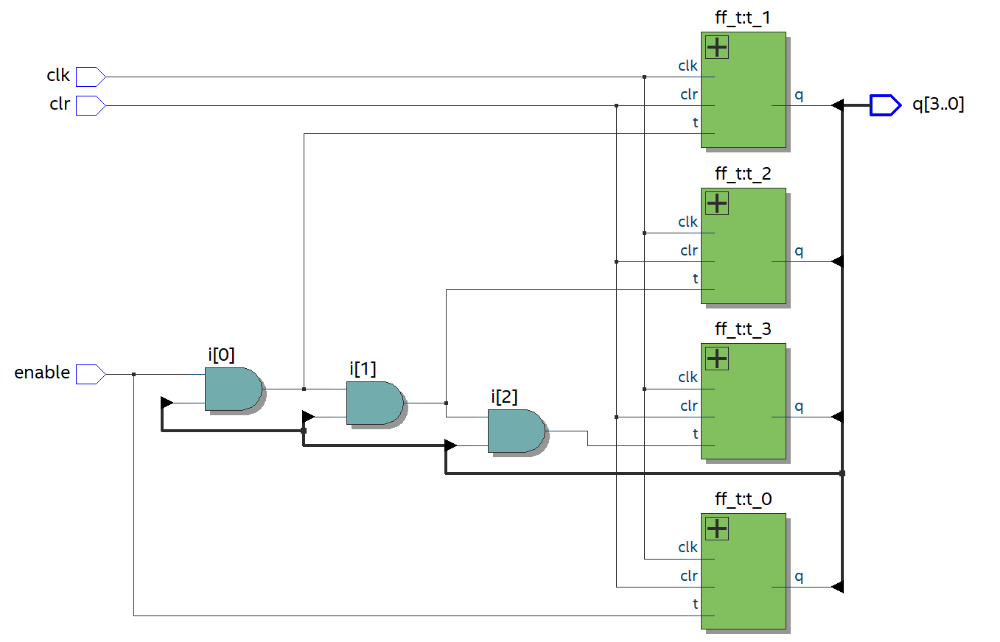

8-bit-counter
=============

Foi desenvolvido um contador de 8 bits utilizando oito flip-flops tipo T.

## Quantidade de elementos lógicos utilizados

Seguindo a [definição de LEs dada pela Intel](https://www.intel.com/content/www/us/en/programmable/quartushelp/17.0/reference/glossary/def_logelem.htm),
podemos analisar a saída do Technology Map Viewer do Intel Quartus Prime para concluir que:

Um latch D, da forma que implementamos, usa 6 elementos lógicos. Um flip-flop tipo D usa dois latches D
e um flip-flop tipo T usa um flip-flop tipo D. Portanto, cada flip-flop tipo T usa 12 elementos lógicos.

Além dos oito flip-flops tipo T, usamos um conjunto de sinais intermediários com a lógica necessária
para a entrada de cada flip-flop tipo T. Esse conjunto foi implementado usando um elemento lógico.

Portanto, o contador de 8 bits usa 97 elementos lógicos.

## Comparação entre o RTL viewer e o circuito dado

|  |
|:--:|
| *Circuito dado na parte I* |

|  |
|:--:|
| *Circuito gerado pelo RTL viewer* |

Nota-se que os dois circuitos são efetivamente idênticos.

## Organização

Cada arquivo VHDL declara uma entidade correspondente; o `main.vhdl` instancia o contador
e os controladores dos displays de sete segmentos (`hex.vhdl`).

`main_4.vhdl` contém o código referente ao contador de 4 bits.
