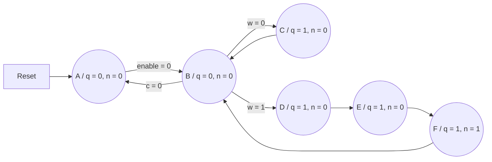

morse
=====

O objetivo desse exercício é reimplementar 
[o circuito desenvolvido anteriormente](../../morse) para codificar uma letra
em código morse, usando Máquina de Estados (FSM). Escolhemos usar uma Máquina de
Estados de Moore, cuja representação gráfica é exibida a seguir.

O estado $ A $ é o estado inicial, onde devemos aguardar até que o
usuário pressione o botão $ \textrm{enable} $. O estado $ B $ é um
estado de pausa entre cada pulso do código morse, que retornará ao
estado inicial caso a contagem da quantidade restante de pulsos que
devem ser exibidos chegue a zero. As saídas da FSM são $ q $ (o 
código em si) e $ n $ (sinal para decrementar o contador do tamanho da
sequência restante e habilitar o registrador de deslocamento que guarda
a sequência de pulsos do código morse por um ciclo de clock).
