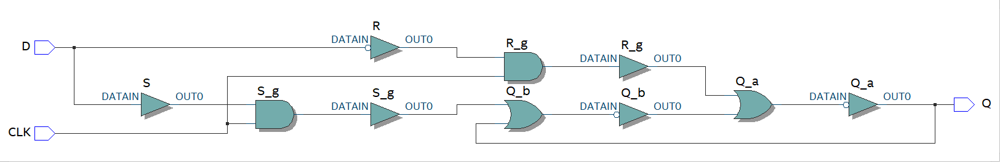
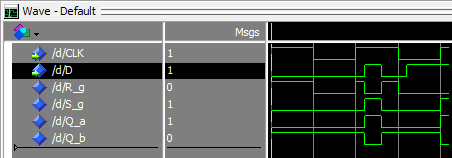

Latch D
=======

O latch D é um circuito que é composto essencialmente por um latch SR, porém
com um sinal de entrada D, que é conectado diretamente ao sinal S e negado 
para ser então conectado a R. Assim, é possível garantir que o latch nunca 
entrará em um estado onde tanto S quanto R estão ativados, o que não é ideal,
uma vez que ao sair desse estado, o latch se encontrará em um estado indeterminado.

Foi implementado um latch *gated*, ou seja, cujo estado só poderá ser alterado
quando o clock estiver em nível lógico 1.

## Tabela-verdade

 D | CLK | Q(t + 1)
---|-----|---------
 x |  0  | Q(t)
 0 |  1  | 0
 1 |  1  | 1
 
O latch mantém seu estado anterior se o nível lógico de CLK (clock) for 0, 
caso contrário Q será determinado de acordo com D.

## Imagens

