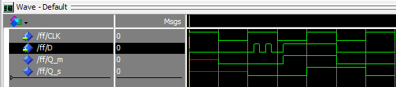

Flip-flop
=========

O flip-floop é um circuito que é capaz de reter estado, de forma 
similar ao latch. Diferentemente do latch, no entanto, o flip-flop 
opera por borda, em vez de por nível, ou seja, só terá seu estado
alterado por um determinado sinal de entrada se esse sinal se estender 
pelo período de tempo correspondente à mudança de nível do clock:

O período de tempo em que o nível lógico de um sinal altera de 0 para 1
é denominado "borda de subida", enquanto o período em que o nível lógico
altera de 0 para 1 é denominado "borda de descida".

Há vários tipos de flip-flop. Nesse exercício, foi explorado apenas o tipo D.
 
Um flip-flop tipo D pode ser compreendido como dois latches D encadeados (a saída
de um latch, denominado mestre/"master", corresponde à entrada do outro,
denominado escravo/"slave". O clock de um latch é negado com relação ao
clock do outro latch. Assim, só é possível armazenar informação durante a
borda do clock, uma vez que o sinal deve passar pelo primeiro latch e esperar
o sinal do clock inverter para passar pelo segundo latch.

Caso o clock do master seja negado com relação ao clock do flip-flop, o flip-flop
só armazenará informação na borda de descida do clock. Caso o clock do slave seja
negado com relação ao clock do flip-flop, o flip-flop só armazenará informação na
borda de subida do clock.

## Tabela-verdade (borda de subida)

 D | CLK | Q(t + 1)
 --|-----|----------
 x |  0  |  Q(t)
 x |  1  |  Q(t)
 0 | $\uparrow$ | 0
 1 | $\uparrow$ | 1
 
 ## Imagens

