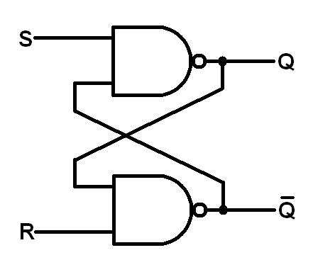

sr-latch
========

O circuito Latch SR é um circuito simples capaz de armazenar um bit de memória, 
é formado por duas portas lógicas NOR (ou NAND), conectando a saída de uma com a entrada da outra.
O outro sinal de entrada de cada porta lógica é o $S$ e o $R$, respectivamente.

 S | R | $Q(t+1)$
---|---|----------
 0 | 0 |  $Q(t)$  
 0 | 1 |    0
 1 | 0 |    1
 1 | 1 |    -

  
## Estrutura

A entrada é composta pelos sinais $S$ (set), $R$ (reset) e clock. Quando habilitado, o sinal $S$
faz o latch armazenar nível lógico $1$, enquanto o $R$ faz o latch armazenar nível lógico $0$.
No Latch, a saída da primeira porta NOR é conectada à entrada da segunda e vice-versa.

## Funcionamento

O funcionamento do Latch SR é simples, no caso $S = 1$ e $R = 0$, as saidas serão $Q = 1$ e 
$\overline{Q} = 0$ (o valor armazenado é $1$); invertendo os sinais de entrada, a saída também será
invertida. O caso $S = 1$ e $R = 1$ deve ser evitado, pois leva o circuito a um estado indefinido.

Quando o latch possui um sinal de clock, esse sinal impede que qualquer valor de entrada seja armazenado
enquanto tiver nível lógico $0$, por isso denominamos esse tipo de latch "gated". De outra forma,
podemos dizer que esse tipo de latch depende do clock e opera por nível (nível lógico $1$ do clock).
Esse foi o tipo de latch implementado.
